# ReadAnki

読んでいる英語のWebページを、そのまま教材と単語帳にする Chrome / Edge 拡張機能です。

- 分からない英文を選ぶと、AIが構文（S/V/O）・文法・語彙を解説します。
- 解説から、数クリックで Anki カードを作れます（語彙穴埋め / 文法 / 英日 / 日英）。
- 「＋単語」で集めた語は記事ごとの単語帳になり、Anki がなくても単語テストができます。
- AIは自分のAPIキーを使う方式（BYOK）です。Gemini の無料枠や、PC上で動かすローカルLLMでも使えます。開発者のサーバーは経由しません。

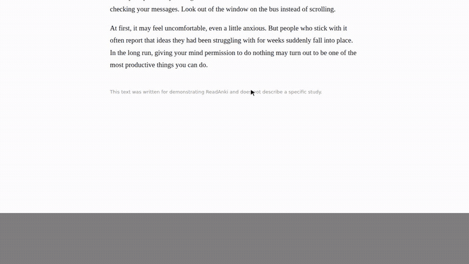

---

## 目次

1. [必要なもの](#1-必要なもの)
2. [インストール（5分）](#2-インストール5分)
3. [最初の設定（AIキーと同意）](#3-最初の設定aiキーと同意)
4. [Ankiの準備](#4-ankiの準備)
5. [使い方](#5-使い方)
6. [単語帳と単語テスト](#6-単語帳と単語テスト)
7. [設定項目の一覧](#7-設定項目の一覧)
8. [うまく動かないとき](#8-うまく動かないとき)
9. [更新のしかた](#9-更新のしかた)
10. [プライバシー](#10-プライバシー) / [ライセンス](#ライセンス)

---

## 1. 必要なもの

| もの | 必須？ | 説明 |
|---|---|---|
| Google Chrome または Microsoft Edge（PC版） | 必須 | スマホ版のブラウザでは使えません。 |
| AIのAPIキー（またはローカルLLM） | 必須 | おすすめは Google Gemini（無料枠あり）。取り方は[3章](#3-最初の設定aiキーと同意)。 |
| Anki（PC版）＋ アドオン AnkiConnect | 任意 | Ankiカードを作るときだけ必要です。単語帳と単語テストは Anki なしで使えます。 |

> Firefox版はリリース予定です。Chrome Web Store での公開は未定のため、今は下の手順でZIPから読み込みます。

---

## 2. インストール（5分）

### 2-1. ZIPをダウンロードして解凍する

1. このページ上部の緑色の **「Code」** ボタン → **「Download ZIP」** を押します。
2. ダウンロードした ZIP を解凍します（Windows: 右クリック →「すべて展開」）。
3. 解凍してできたフォルダを、**消さない場所**に置きます（例: `ドキュメント\ReadAnki`）。

> ⚠️ 拡張機能は、このフォルダから読み込まれ続けます。読み込んだあとにフォルダを消したり移動したりすると、ReadAnki が動かなくなります。

### 2-2. Chrome / Edge に読み込む

1. アドレスバーに次を入力して開きます。
   - Chrome: `chrome://extensions`
   - Edge: `edge://extensions`
2. Chrome は右上の **「デベロッパー モード」** をオンにします（Edge は左側の「開発者モード」）。
3. **「パッケージ化されていない拡張機能を読み込む」**（Edge は「展開して読み込みます」）を押します。

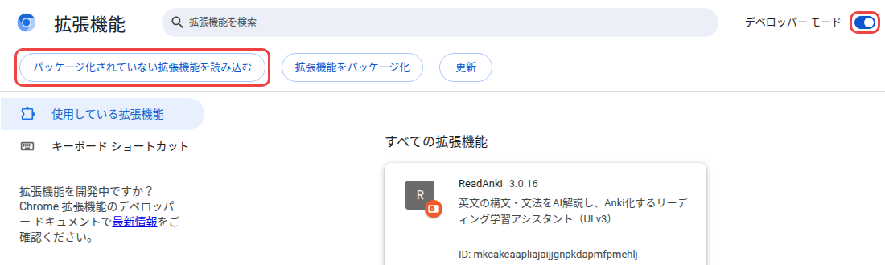

4. フォルダを選ぶ画面で、解凍したフォルダの中にある **`extension` フォルダ**を選びます。

   ```
   ReadAnki-OSS-main/        ← これではなく（名前は少し違うことがあります）
   ├─ docs/
   ├─ extension/             ← これを選ぶ（中に manifest.json がある）
   ├─ LICENSE
   └─ README.md
   ```

5. 一覧に「ReadAnki」が出れば完了です。
6. ブラウザ右上のパズルのアイコン（🧩）→ ReadAnki の📌を押すと、アイコンが常に表示されて使いやすくなります。

---

## 3. 最初の設定（AIキーと同意）

ReadAnki のアイコン →「⚙️ 拡張機能の設定を開く」で設定画面が開きます。初回は「🔒 プライバシー」タブが開きます。

### 3-1. 同意する（必須）

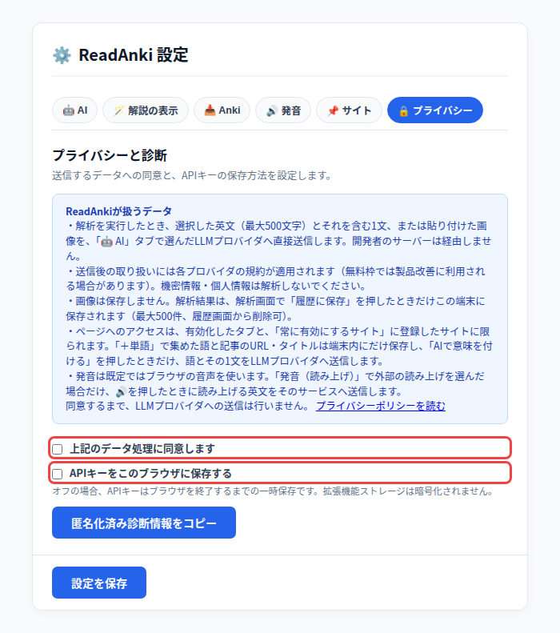

1. 内容を読み、**「上記のデータ処理に同意します」** にチェックを入れます。同意するまで、AIへの送信は一切行いません。
2. **「APIキーをこのブラウザに保存する」** は好みで選びます。
   - オン: 次にブラウザを開いたときも、キーが残ります（おすすめ）。
   - オフ: ブラウザを閉じるとキーが消え、毎回入力し直しが必要です。
   - どちらの場合も、キーはこのPCのブラウザ内にだけ置かれます（暗号化はされません）。

### 3-2. AIを選んでAPIキーを入れる

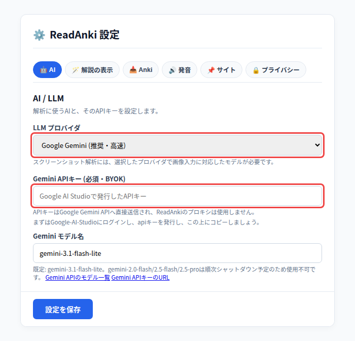

**Gemini を使う場合（おすすめ・無料枠あり）**

1. [Google AI Studio](https://aistudio.google.com/apikey) に Google アカウントでログインします。
2. 「APIキーを作成（Create API key）」を押し、表示されたキーをコピーします。
3. 設定画面の「🤖 AI」タブで、LLM プロバイダを **「Google Gemini (推奨・高速)」** にします。
4. **「Gemini APIキー」** にキーを貼り付けます。モデル名は既定のままで大丈夫です。
5. 画面下の **「設定を保存」** を押します。

> 無料枠では、送った文章が Google の製品改善に使われる場合があります。機密情報や個人情報は解析しないでください。

**ほかのAIを使う場合**

| プロバイダ | 入れるもの | メモ |
|---|---|---|
| OpenAI | APIキー（`sk-...`）とモデル名 | 既定のモデルは `gpt-4o-mini`。従量課金です。 |
| OpenAI互換（LM Studio など） | URL とモデル名 | 完全にPC内で動きます。LM Studio なら、モデルを読み込み「Start Server」→ URL を `http://localhost:1234/v1` に。 |
| Ollama | エンドポイントとモデル名 | 起動前に `set OLLAMA_ORIGINS=chrome-extension://*` が必要です（下の注意を参照）。 |

> Ollama で `OLLAMA_ORIGINS=*` にすると、どのWebサイトからでもローカルLLMを呼び出せてしまいます。`chrome-extension://*` にしてください。
>
> ```cmd
> set OLLAMA_ORIGINS=chrome-extension://*
> ollama serve
> ```

---

## 4. Ankiの準備

Ankiカードを作らないなら、この章は飛ばしてかまいません。

### 4-1. AnkiConnect を入れる

1. [Anki](https://apps.ankiweb.net/)（PC版）をインストールして起動します。
2. メニュー「ツール」→「アドオン」→「アドオンを取得」を開きます。
3. コード **`2055492159`** を入力して「OK」を押します（AnkiConnect がインストールされます）。
4. Anki を再起動します。

**AnkiConnect の設定は変えなくて大丈夫です。** 初期設定（`"webCorsOriginList": ["http://localhost"]`）のままで、ReadAnki からの接続を受け付けます。

> ⚠️ `webCorsOriginList` を `["*"]` にはしないでください。どのWebサイトからでも、あなたの Anki を操作できるようになってしまいます。

> カードを送るときは、**Anki を起動したまま**にしておいてください。Anki が閉じていると送れません。

### 4-2. ReadAnki側の設定（ノートタイプ名を確認）

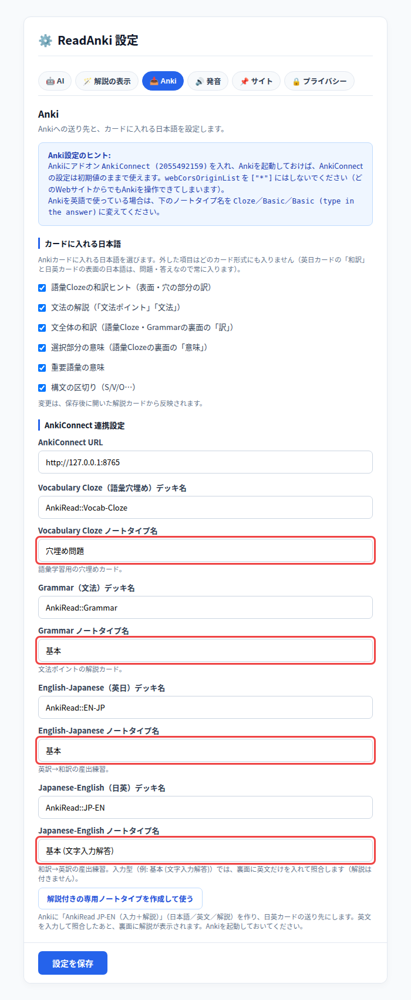

設定画面の「📥 Anki」タブで、**ノートタイプ名**があなたの Anki にある名前と合っているかを確認します。Anki のメイン画面で「ツール」→「ノートタイプを管理」を開くと、名前の一覧を見られます。

| カード形式 | デッキ（初期値） | ノートタイプ（日本語のAnki） | ノートタイプ（英語のAnki） |
|---|---|---|---|
| 語彙Cloze（穴埋め） | `AnkiRead::Vocab-Cloze` | `穴埋め問題` | `Cloze` |
| Grammar（文法） | `AnkiRead::Grammar` | `基本` | `Basic` |
| 英日 | `AnkiRead::EN-JP` | `基本` | `Basic` |
| 日英 | `AnkiRead::JP-EN` | `基本 (文字入力解答)` | `Basic (type in the answer)` |

- **英語表示の Anki を使っている人は、右の列の名前に書き換えて「設定を保存」**してください。ここが合っていないと、「ノートタイプが見つかりません」と出ます。
- デッキは、最初にカードを送ったときに自動で作られます。名前は自由に変えられます。
- フィールド名（「表面」「Front」など）は、ReadAnki が自動で合わせます。
- 日英カードで、英文を入力して答え合わせをしたあとに解説も見たい場合は、Anki を起動した状態で **「解説付きの専用ノートタイプを作成して使う」** を押します。

---

## 5. 使い方

### 5-1. ページで有効にする

ReadAnki は、**あなたが有効にしたタブ（またはサイト）でだけ**動きます。英語の記事を開いたら、次のどれかで有効にします。

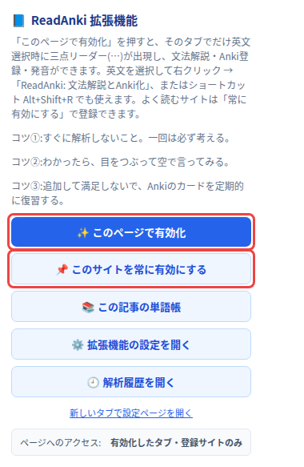

- ReadAnki のアイコン → **「✨ このページで有効化」**（そのタブだけ。ページを移動したら、もう一度押します）
- ReadAnki のアイコン → **「📌 このサイトを常に有効にする」**（よく読むサイト向け。次からは押さなくても動きます）
- ショートカット **`Alt+Shift+R`**
- 英文を選んで右クリック →「ReadAnki: 文法解説とAnki化」

### 5-2. 英文を選んで解説を見る

1. 分からない英文（500文字まで）をマウスで選びます。すぐ上に **「⋯ ReadAnki」** と **「＋単語」** が出ます。

   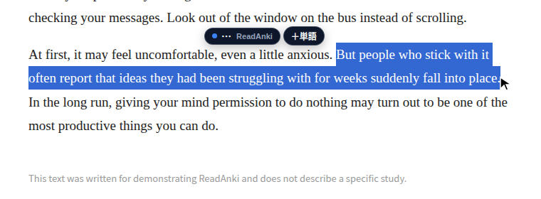

2. **「⋯」** を押してメニューを開き、**「🪄 解説」** を押します。数秒で解説カードが開きます。
   - 原文の構造（S / V / O / M）、和訳、文法ポイント、重要語彙が表示されます。
   - 「🔊」で発音を聞けます。

   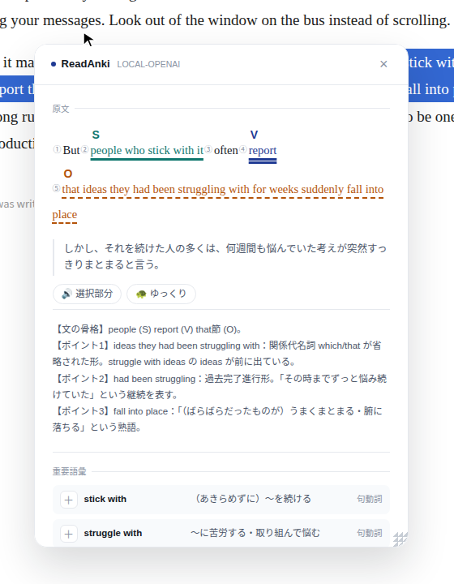

> コツ: すぐに解説を開かず、一度は自分で考えてから確かめると、記憶に残りやすくなります。

### 5-3. Ankiカードにする

1. 解説カードの **「✎ 編集・カード形式」** を押します。
2. カード形式を選びます。

   | 形式 | 表面 → 裏面 | 向いている練習 |
   |---|---|---|
   | 語彙Cloze | 穴の開いた英文＋和訳ヒント → 答え | 表現を文の中で覚える |
   | Grammar | 英文 → 文法の解説 | 構文・文法の理解 |
   | 英日 | 英文 → 和訳 | 読んで意味を取る |
   | 日英 | 和訳 → 英文 | 英語で言えるようにする |

3. 語彙Cloze では、**穴にしたい単語を押して選びます**（続けて選んだ単語は1つの穴になります。Shift＋クリックで範囲選択）。
4. 内容を確認し、必要なら直してから **「Ankiに追加（試験中）」** を押します。

   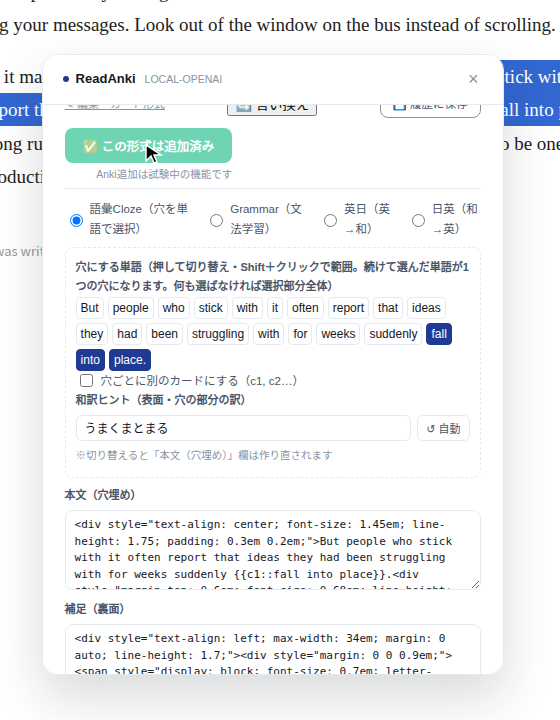

5. Anki の指定したデッキにカードが入ります。

   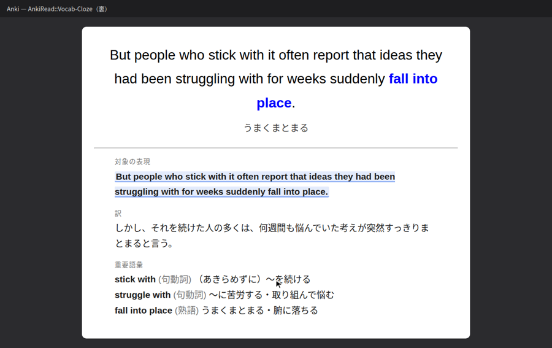

   *Anki での表示イメージです（Anki 標準の穴埋めカードの見た目を再現したもの）。*

> 解析結果は自動では保存されません。あとで見返したいときは、解説カードの **「💾 履歴に保存」** を押してください。

---

## 6. 単語帳と単語テスト

英文を選んで **「＋単語」** を押すと、その語が**記事ごとの単語帳**に入ります（この操作では、AIに何も送りません）。ReadAnki のアイコン →「📚 この記事の単語帳」で開きます。

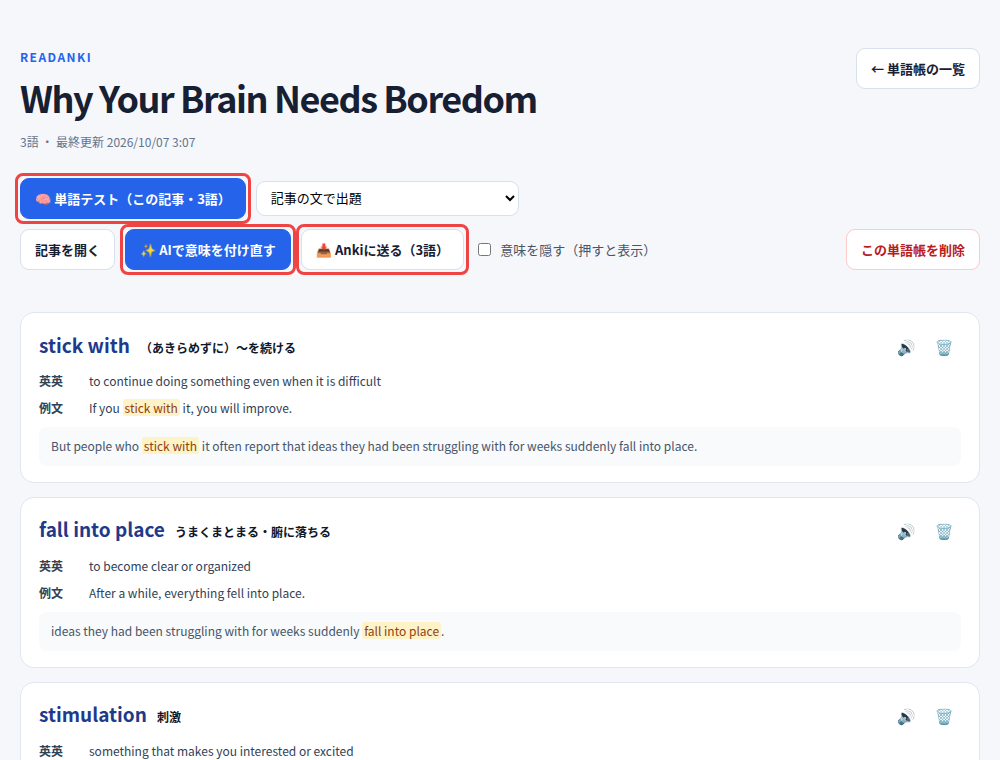

| ボタン | すること |
|---|---|
| 🧠 単語テスト | 記事の文の中で語を出題します。思い出してから答えを見て、「忘れた / 難しい / 簡単 / 覚えた」を選ぶと、次に出題する時期（3分後〜6日後）が自動で決まります。 |
| ✨ AIで意味を付ける | 集めた語に、日本語の意味・英英定義・例文を付けます（このときだけAIに送信します）。 |
| 📥 Ankiに送る | 単語を記事の文の中で穴埋めにした、語彙Clozeカードとしてまとめて送ります。 |

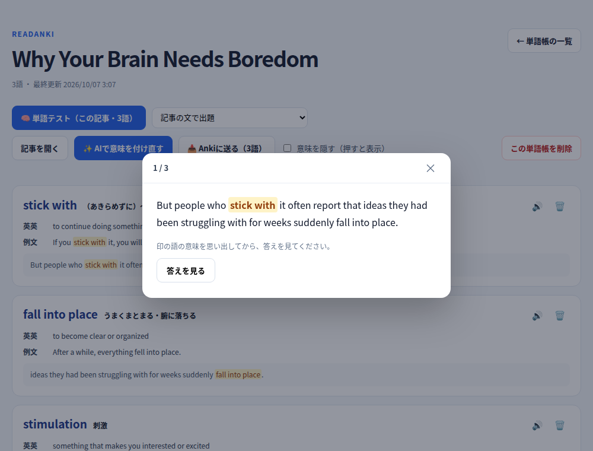

---

## 7. 設定項目の一覧

設定を変えたら、最後に画面下の **「設定を保存」** を押してください。

### 🤖 AI
[3-2](#3-2-aiを選んでapiキーを入れる) を参照してください。

### 🪄 解説の表示

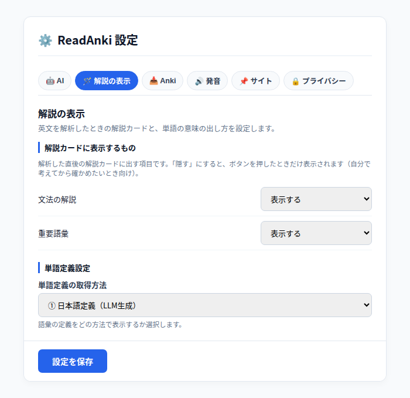

| 項目 | 説明 |
|---|---|
| 文法の解説 / 重要語彙 | 解説カードに「表示する」「隠す（押すと表示）」「表示しない」から選びます。自分で考えてから確かめたい人は「隠す」がおすすめです。 |
| 単語定義の取得方法 | 単語の意味を ① 日本語（AI）② 英語の言い換え（AI）③ 外部の辞書サイトへのリンク から選びます。 |

### 📥 Anki
[4-2](#4-2-readanki側の設定ノートタイプ名を確認) のほか、次の設定があります。

| 項目 | 説明 |
|---|---|
| カードに入れる日本語 | 和訳ヒント、文法の解説、文全体の和訳、選択部分の意味、重要語彙、構文の区切りを、カードに入れるかどうかを選べます。日本語を減らして、英語で考える練習にしたいときに外します。 |
| AnkiConnect URL | 通常は `http://127.0.0.1:8765` のままです。 |

### 🔊 発音

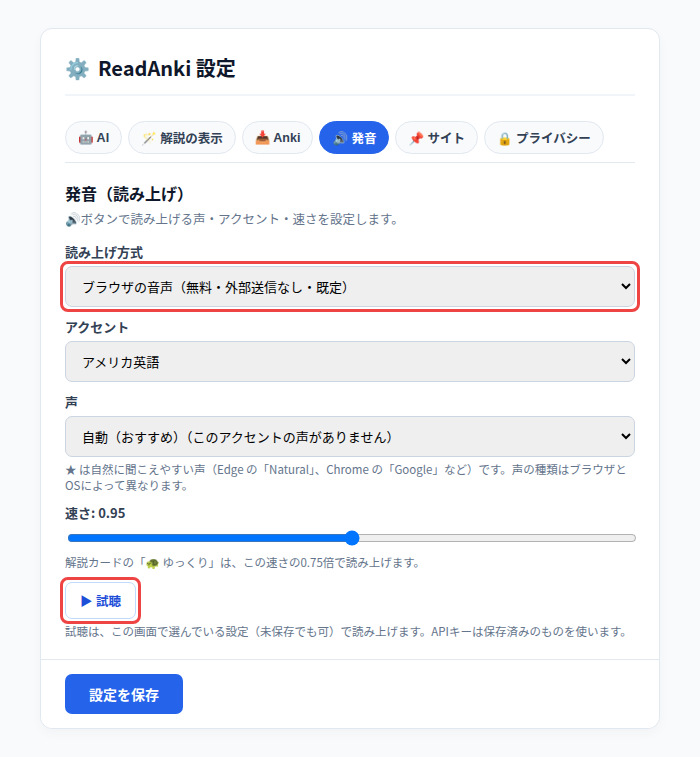

| 項目 | 説明 |
|---|---|
| 読み上げ方式 | 既定は「ブラウザの音声」（無料・外部送信なし）。高音質にしたい場合は Gemini / OpenAI / ローカルTTS も選べます（🔊を押したときだけ、その英文を送信します）。 |
| アクセント / 声 / 速さ | アメリカ・イギリス・オーストラリア・インド英語から選べます。「▶ 試聴」で確かめられます。 |

### 📌 サイト

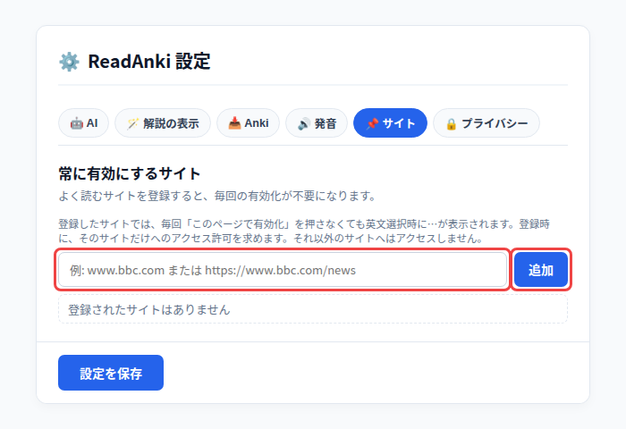

よく読むサイト（例: `www.bbc.com`）を登録すると、毎回「このページで有効化」を押さなくても動きます。登録するときに、**そのサイトだけ**へのアクセス許可を求めます。

### 🔒 プライバシー
[3-1](#3-1-同意する必須) を参照してください。**「匿名化済み診断情報をコピー」** は、直前のエラーの内容をコピーします（APIキーは自動で伏せ字になります）。不具合を報告するときに使ってください。

---

## 8. うまく動かないとき

| 症状・表示 | 原因と直し方 |
|---|---|
| 読み込むときに「マニフェスト ファイルが見つからない」 | 選んだフォルダが違います。中に `manifest.json` がある **`extension` フォルダ**を選んでください（[2-2](#2-2-chrome--edge-に読み込む)）。 |
| 英文を選んでも「⋯」が出ない | そのタブで有効になっていません。アイコン →「✨ このページで有効化」を押してください。ページを移動したら、もう一度押します。PDFや `chrome://` のページでは使えません。 |
| 「初回設定でデータ処理への同意が必要です」 | 設定の「🔒 プライバシー」で同意にチェックを入れ、「設定を保存」を押してください。 |
| 「Gemini APIキーが設定されていません」 | 「🤖 AI」タブでキーを入れて保存してください。ブラウザを再起動したら消えた場合は、「APIキーをこのブラウザに保存する」がオフになっています。 |
| 「Gemini APIエラー (HTTP 400 / 403)」 | キーが間違っているか、無効です。Google AI Studio でキーを確認してください。 |
| 「Gemini APIエラー (HTTP 429)」 | 無料枠の回数制限です。少し時間をおいてから試してください。 |
| 「AnkiConnectエラー: Failed to fetch」 | Anki に接続できていません。**Anki が起動しているか**、AnkiConnect が入っているかを確認してください。 |
| 「Ankiにノートタイプ「○○」が見つかりません」 | ノートタイプ名が Anki と合っていません。英語の Anki なら `Cloze` / `Basic` などに変えてください（[4-2](#4-2-readanki側の設定ノートタイプ名を確認)）。 |
| 「同じ内容のカードが既にAnkiにあります」 | 同じカードを二度送ろうとしています。内容を変えるか、Anki 側を確認してください。 |
| 「短時間にAIへの送信が多すぎるため、一時的に止めています」 | 1つのタブから1分間にAIを30回より多く呼ぶと、課金の暴走を防ぐために止まります。1分ほど待ってから試してください。 |
| 「単語帳は300記事までです」 | 単語帳の一覧（アイコン →「📚 この記事の単語帳」→「← 単語帳の一覧」）で、使わない記事の単語帳を削除してください。 |
| 「モデルの応答にJSONが含まれていません」 | ローカルLLMが指示どおりに答えていません。Llama 3.2 Instruct や Qwen2.5 Instruct など、指示に従うタイプのモデルに変えてください。 |

解決しないときは、「🔒 プライバシー」タブの **「匿名化済み診断情報をコピー」** の内容を添えて、[Issues](https://github.com/sshtorr-rgb/ReadAnki-OSS/issues) で報告してください。

---

## 9. 更新のしかた

1. 新しい ZIP をダウンロードし、**前と同じフォルダ**に中身を上書きします。
2. `chrome://extensions` を開き、ReadAnki の 🔄（再読み込み）ボタンを押します。

> 前と違う場所のフォルダを読み込むと、別の拡張機能として扱われ、設定・単語帳・履歴が引き継がれません。

---

## 10. プライバシー

- 解析を実行したときだけ、選んだ英文（最大500文字）とそれを含む1文、または貼り付けた画像を、設定で選んだAIのサービスへ**直接**送ります。開発者のサーバーは経由しません。
- APIキー、単語帳、履歴は、あなたのPCのブラウザ内にだけ保存されます。
- ページを読めるのは、有効にしたタブと、登録したサイトだけです。

詳しくは [プライバシーポリシー](https://sshtorr-rgb.github.io/ReadAnki-OSS/privacy.html) を読んでください。

## ライセンス

MIT License（[LICENSE](LICENSE)）
